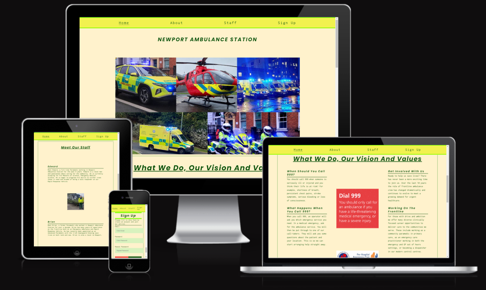
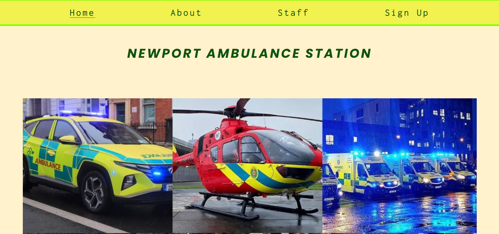
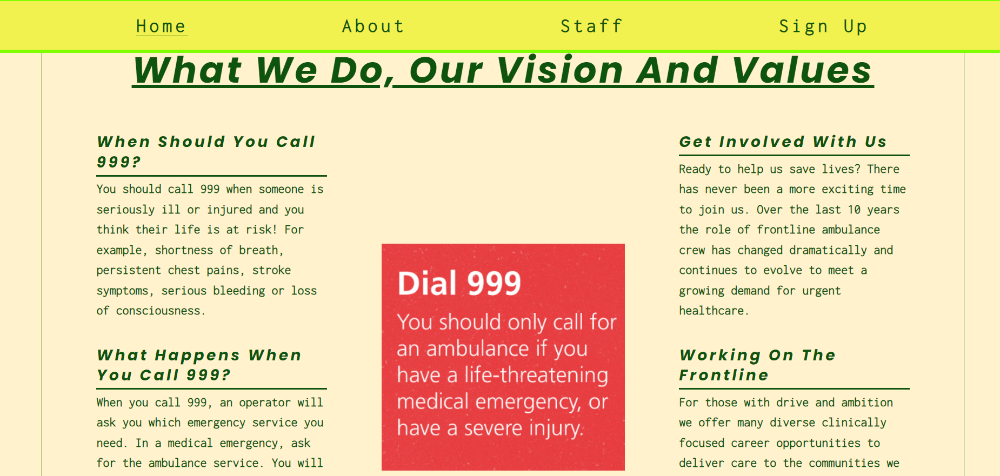
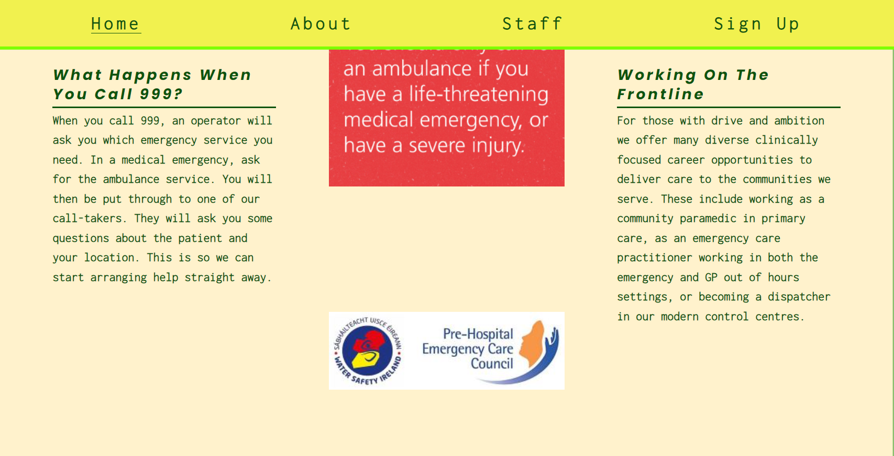
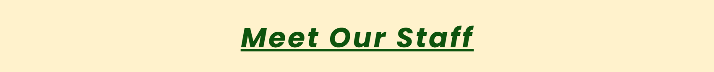
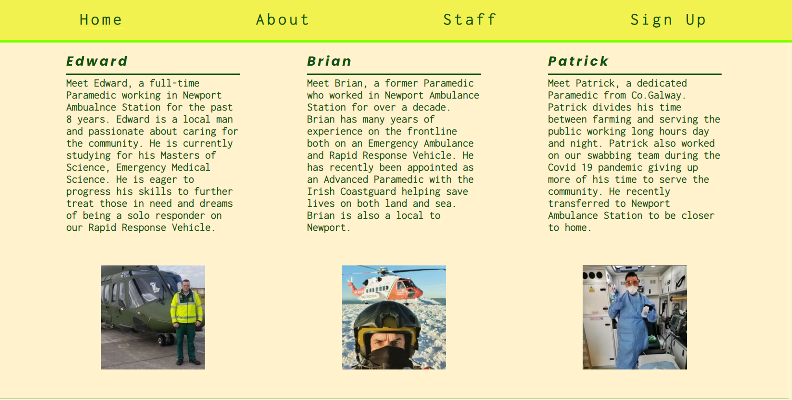
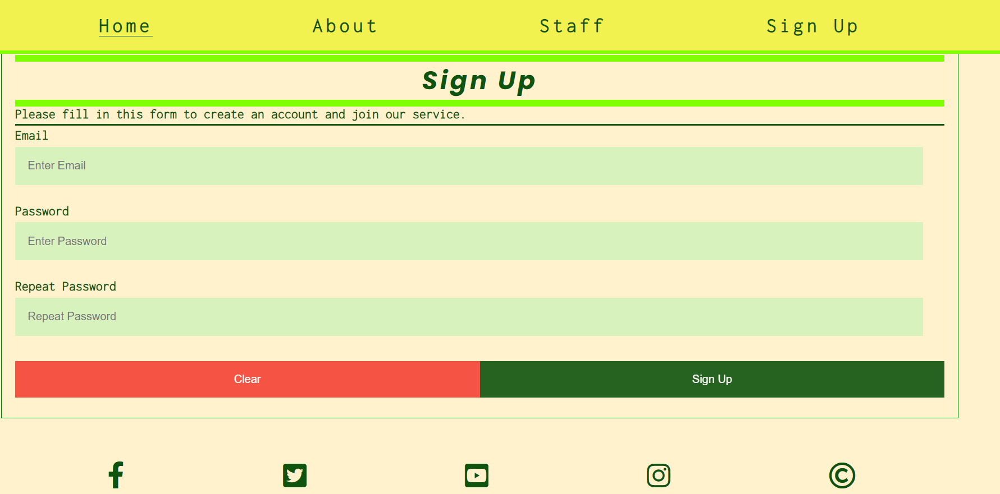
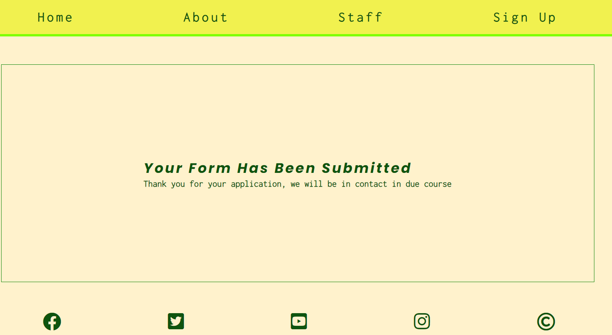
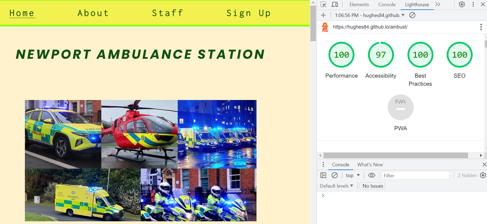

# Newport Ambulance Station 🚑
                                                                

# Introduction 

This website gives an insight into the core values and purpose of an Ambulance service. You will see real images of The Irish National ambulance service fleet from ambulances, rapid response vehicles to motorbikes and helicopters. You will learn how the process works from when you dial 999 until the Emergency services arrive at your door. With a description of working on the front line and how the roles have evolved over the past decade you will be given the opportunity to sign up to apply for a position in the Ambulance Service. You will be introduced to three real life Paramedics and their different roles and journeys.

Here you will find a live link to my website: https://hughes84.github.io/ambust/

___

# Table of Contents

- [User stories](#User-stories)
    - [First time visitor goals](#First-time-visitor-goals)
    - [Returning visitor goals](#Returning-visitor-goals)
    - [Frequent visitor goals](#Frequent-visitor-goals)
- [Visual Studio Code](#Visual-Studio-Code)
- [Design](Design)
    - [Wireframe-Testing](#Wireframe-Testing)
 - [Features](#Features)
    - [Existing Features](#Existing-Features)
    - [Navigation-Deployment](#Navigation-Deployment)
    - [HTML](#HTML)
    - [CSS-Further testing](#CSS-Further-testing)
    - [Lighthouse testing](#Lighthouse-testing)
- [Colours](#Colours)
- [Typography](#Typography)
- [Imagery](#Imagery)
- [Bugs](#Bugs)
- [Credits](#Credits)
- [Media](#Media)
- [Acknowledgments](#Acknowledgments)

# User Stories

**First time visitor goals**
   
   1. As a first time visitor on this site, I want to know what the site is about without having to read too much content.
   2. As a first time visitor on this site, I want the title, headings and descriptions to be easily found and easily understood. 
   3. As a first time visitor on this site, I don't want to be left confused with any navigation issues or detailed descriptions.
      

**Returning visitor goals**

   1. As a returning visitor to this site, I want my experience to be as easy as the first and know how to navigate to where I want to go. 
   2. As a returning visitor to this site, I want have easy access to signing up to the service.

**Frequent visitor goals**

   1. As a frequent user to this site, I want to view some new pictures or updates on the service.
   2. As a frequent user to this site, I want to read more about the service and updates on joining or promotions.
   3. As a frequent user to this site, I want to check to see if there is any local news, or any new updates to the website.
      

# Visual Studio Code

VS Code my main platform used to code while utilizing the terminal to commit and Push to GitHub.

[Back to Table of Contents](#table-of-contents)

# Design

**Wireframe**

I invisaged my first website to be basic, prompt and staright to the point. I wanted some images to jump out to grab the users attention immediately. 

[Back to Table of Contents](#table-of-contents)

# Features

**Navigation:**

My navigation bar is placed on the top of the page underneath the logo. It displays clicklable tabs which will bring us on directly onto the pages clicked, Home, About, Staff, Sign up. When scrolling it will stay fixed as to allow the user to go to any section they want with ease.

[Back to Table of Contents](#table-of-contents)

# Existing Features

The user is first met by the menu screen. Here they can see the name of the site in big bold colours with the menu clearly visible above. Below these, is an image of several different fleet from the Emergency services that I feel will draw the user in with the colours, detail and variety. I aimed to catch the users attention with the bright illuminous colours of the vehicles and the glow of the flashing lights. I added a neutral background colour which I felt complimented these colours well.

Next the user is met with the heading of the second section. With just a few simple words the user knows what this section is about straight away. There is a logo below this of when to call 999. I give a brief synopsis on the left of the page of same, and another to the right of the page on getting involved, giving the user food for thought on whether this could be a role for them.

Further down in the same section I have a centre logo of the Pre Hospital Emergency Care Council, the governing body who issues Paramedic licences in Ireland. To the left of the page I give a description of the process of what happens when you dial 999 to the time the emergency services arrive at your door. On the right of the page I explain the different roles there is in the service, showing that there is a variety of careers to explore on and off the road. I believe these short but detailed paragraphs give enough information to captivate the users attention.

[Back to Table of Contents](#table-of-contents)

Scrolling down, I introduce the user to three of my colleagues from the service. Two paramedics that work on an ambulance and an advanced paramedic who works on a helicopter with the Irish Coastguard. I give the user a look into each medics background, skills and goals for the future with a picture of each in a different setting again making it real and giving variety, keeping the users attention. 

At the end of the site the user is met with the sign up page. Here the user is given the option to make an account, signing up to join the service. The user must enter a valid email address to submit the form. On completion of entering a valid email address and password the user will click the sign up button below. They will then be directed to a new page, where the following message will appear; Thank You, Your Form Has Been Submitted!Thank you for your application, we will be in contact in due course.
If the user wishes to clear their entry and start over, this can be done using the clear button.
On the bottom of the page there are five live links to Facebook, Twitter, Youtube, Instagram and Copyright.

[Back to Table of Contents](#table-of-contents)

# Testing

# HTML

**When testing my index.html code i used W3C Markup Validator and found an error.**
I had misused an id tag, I had some uneeded trailing slashs on elements, an unquoted attribute and an extra div.

> This is the result for my index.html page.

[Back to Table of Contents](#table-of-contents)

**When testing my thankyou.html code i used W3C Markup Validator and found no errors.**

> This is the result for my thankyou.html page.

[Back to Table of Contents](#table-of-contents)

# CSS

**When testing my style.css I used W3C CSS Validator and had found no errors.**

> This is the result for my style.css page.

[Back to Table of Contents](#table-of-contents)

# Further testing

- I've tested that this page works in different browsers such as Chrome, Firefox, Microsoft Edge and Safari.
- I've tested that this website is responsive, and looks good on all standard screen sizes the smallest at 320px   all the way up to 1400px.
- I've confirmed that my webiste has good visibility contrast and it's easy readable for the user, with good contrast colours and displaying good accessibility performance.
- I've tested that all internal links are working properly and navigate me through the pages, and clicking the fixed navigation bar brings me back to the relevant section.
- Internal links: Home, About, Staff, Sign Up as well as sign up button and clear button on sign up page.
- I've tested that all external links are taking me to new tab and to related pages that where either in description or in text.
- External links: Facebook, Twitter, Youtube, Instagram and Copyright.
- Where email is required only an email will be accepted in the email field. When all fields are filled correctly you are then sent to thank you page.
- Clear button working as should.
- Fixed navigation bar stays in place for all devices when scrolling.

[Back to Table of Contents](#table-of-contents)

# Lighthouse testing

I used Lighthouse testing to audit for performance and accessibility.

[Back to Table of Contents](#table-of-contents)

# Colours

The colours chosen for this project are those similar to the national ambulance service colours. I used 'green' with it's hex value of '#0e540e', which was used for headings, hover effects and borders, with a background colour of rgba(241, 241, 79, 0.7), on the heading and navigation on the main page. I also used another light green/yellow color to symbolize the luminous bright colour of the Irish ambulances with an rgba(177, 219, 39, 0.7) this also gave the appearance of a see through effect. Around the image of myself I used a brighter 'chartreuse' colour to brighten up the page a bit more with a hex value of '#7fff00'. The input sections on sign up form I used a lighter green of '#d8f2be', and when details are input this changes to a white '#ddd', for clearer viewing. I used a red hex value '#f44336' for my cancel button on sign up form to highlight the cancel. I used a neutral colour of '#FFF2CC' as a background throughout the site which I feel compliments it well.  

# Typography

The Inconsolata font is the title font I used with Sans Serif as the fallback font in case for any reason the font wouldn't import into the site correctly. I used Poppins in my paragraphs as it complimented well with the Inconsolata I felt.

# Imagery

The large, background image stretches through the landing page and is designed to be striking and catch the user's attention at the very first glance and to give the user the idea behind the website. I sourced this image of the fleet of the Irish ambulance service online and downloaded it. I used some pictures of my work collegaues for the staff section from Facebook with their consent.

[Back to Table of Contents](#table-of-contents)

# Bugs

As I was buliding my website I was constantly debuging and changing my code.
I had some preformance issues in the begining but I managed to rectify it by increasing and decreasing the size of my images and testing different style, ie. float to flex. I tested my page regularly through inspect as well as on various different websites for responsive testing.

# Deployment

**Github pages:**

***This project was deployed to GitHub Pages using the following steps;***
1. Log in to GitHub and locate the GitHub Repository.
2. At the top of the Repository, locate "Settings"on the menu.
3. Scroll down the Settings page and on the left you will see the "Pages" section.
4. Under "Source", click the dropdown "None" and select "Main Branch".
5. The page will automatically refresh.
6. Scroll back down through the page to locate the now published site link in the "GitHub Pages" section.
7. Live link for the page can be found here "ambust".

[Back to Table of Contents](#table-of-contents)

# Credits

1. Credit to  W3 Schools for helping me resolve issues while coding throughout and when creating my sign up form.
2. The Love running project from Code Institute was a useful guide at times also and helped me get started.    
3. Slack was also very helpful with peer assistance on occasion when stuck with a code.
4. GitHub for storing the projects code.
5. Color-hex.com for colors.
6. Simplecss.eu for for RGBA to Hex converter.
7. Google fonts for fonts.
8. Text Magic for assistance with indentation.
9. W3C Markup Validation for helping validate my code.
10. I love IMG for helping resize some images.
11. Am I responsive for helping check responsiveness of different sized screen sizes.
12. NHS South Central Ambulance Service. I used this website for some ideas in the about section.
13. Freepik for cartoon images for README.md.
14. Markdownguide.org for syntax for README.md.
15. Visual Studio Code for being my Integrated development environment.
16. NHS UK for Dial 999 logo.
 

# Media

- My main image is taken from a National Ambulance Service Facebook account which is available to the public. 
- The Dial 999 logo below is from the NHS UK website and is available tot the public, 
  https://www.elft.nhs.uk/news/london-ambulance-strike-23-january-advice .
- This is followed by the Phecc logo from thier website, https://www.phecit.ie/ .
- My staff images were taken from personal Facebook accounts of colleagues with their consent. 
- In the footer I have used links to Facebook, Twitter, Youtube, Instagram and Copyright.

# Acknowledgment

Special thank you goes to Laura from Code Institute for keeping me motivated on weekly stand up calls on slack throughout the project. Laura always made herself available for guidance and support.
Thank you to all at Code Institute for the opportunity. 
My mentor Medale Oluwafemi for his help and support towards this project.
My peers on slack, especially Cohort Jamie O'Neill who often took time from his own schedule to organise study groups which were hugely beneficial.

[Back to Table of Contents](#table-of-contents)

